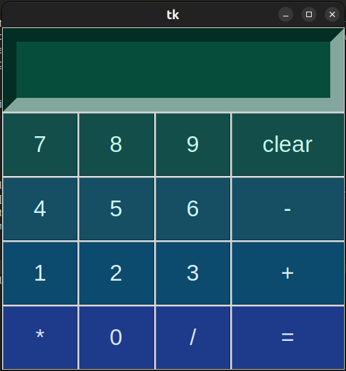

# Calculator Project

## Purpose
This calculator project was developed as a beginner's project to learn Python programming. It serves as an introductory project for individuals who are new to Python and programming in general. By building a simple calculator application, beginners can get hands-on experience with basic Python syntax, user input, and GUI (Graphical User Interface) development using the Tkinter library.

## Technical Description
The calculator application is built using Python and the Tkinter library for creating the graphical user interface. The structure of the project is as follows:
- **Main Script**: `calculator.py` contains the main logic of the calculator application, including functions for arithmetic operations and event handling.
- **GUI Layout**: The graphical layout of the calculator is defined using Tkinter widgets such as Entry for display and Button for input.
- **Styling**: Colors and fonts are applied to the GUI elements using Tkinter's styling options.

## Color Theme
The color theme of the calculator application is designed to provide a visually appealing interface while maintaining readability and usability. The color scheme includes shades of blue and green for the buttons, with contrasting text colors for improved visibility.
<br>


## How to Start the Project on Your Own Device
To run the calculator project on your own device, follow these steps:
1. **Install Python 3**: Ensure that Python3 is installed on your system. You can download Python from the official website: [python.org](https://www.python.org/downloads/)
2. **Clone the Repository**: Clone or download the calculator project repository from [GitHub](https://github.com/lynsoley/calculator)
3. **Navigate to the Project Directory**: Open a terminal or command prompt and navigate to the directory where you cloned the project.
4. **Run the Script**: Execute the `calculator.py` script by running the following command:
    ```
    python3 calculator.py
    ```
5. **Use the Calculator**: Once the script is running, the calculator GUI will open, allowing you to perform basic arithmetic operations.